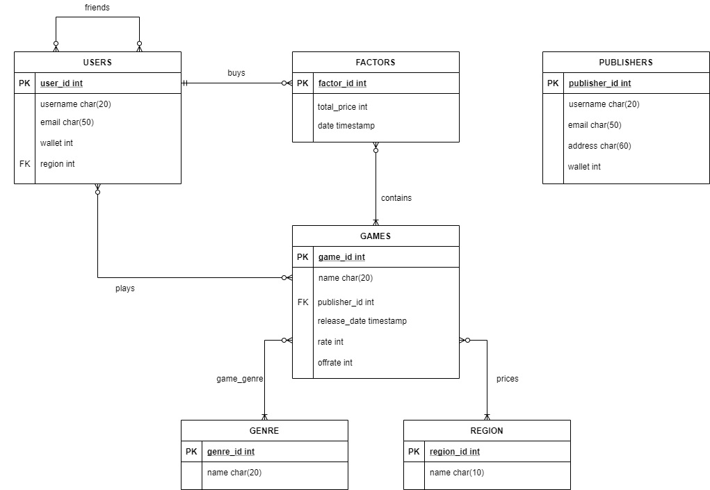

Steam database
=========
This is a simplified version of [Steam](https://store.steampowered.com/) databases. The database design is my interpretation and does necessarily resemble what's going on behind Steam.

Table of contents
=================

<!--ts-->
   * [Introduction](#introduction)
   * [Tables](#tables)
   * [Roles](#roles)
   * [Mongo](#mongo)
   * [Server Prototype](#server-prototype)
   * [Table of contents](#table-of-contents)
<!--te-->

Introduction
=====
In this system, users can login and buy games with the built-in wallet system, then play and rate them.
A very simple friends tables is also implemented to mimic the community functionality.

Publishers can add new games and set their prices for different regions and also discount their games.

The basic ERD is shown here:


Tables
=====
In [src/tables.sql](https://github.com/URAmiRBin/steamdb/blob/main/src/tables.sql), Postgre tables are implemented.

> **Note:** The **Factors** tables will be implemented using Mongo

The tables of entities include:

Users
| user-id | user-name | email                | wallet | region-id |
|---------|-----------|----------------------|--------|-----------|
| 1       | amirbin   | ur.amirbin@gmail.com | 69.69  | 1         |

Genres
| genre-id | genre-name |
|----------|------------|
| 1        | action     |

Regions
| region-id | region-name | region-currency |
|-----------|-------------|-----------------|
| 1         | US          | USD             |

Publishers
| publisher-id | publisher-name | email       | address   | wallet |
|--------------|----------------|-------------|-----------|--------|
| 1            | Rockstar games | info@rs.com | Scottland | 300.20 |

Games
| game-id | game-name | publisher-id | release-date | voted | rate | offrate |
|---------|-----------|--------------|--------------|-------|------|---------|
| 1       | LA Noire  | 1            | 17/05/2011   | 205   | 190  | 25      |

In this table, the voted indicates how many players voted this game and rate shows how many of them voted "yes".
Offrate column shows the dicount percent.

 
The tables of relations include:
  - friends
  - game_genres
  - game_prices
  - user_games
  - curator_logs
  

Roles
=====
In [src/roles/](https://github.com/URAmiRBin/steamdb/tree/main/src/roles) 5 roles are added.
Using RLS policies and role access, the database is secure.
Roles used in this project:

  - users
  - publishers
  - curators : can add genres and assign genres to games
  - admin
  - visitor : can see games and their genres and prices
  
> **TIP:** Use set to bind to a user or publisher to check RLS

```
set my.user_id = 1
```

or


```
set my.publisher_id = 1
```

Mongo
=====
Server processes buy requests, using Postgre transactions. If the transaction is successful, then the game is added to user's library and a factor is added to Mongo.
The factors are stored in Mongo using server after being processed.
To setup:
```
use steam
db.createCollection(factors)
```

Each factor include user_id and a list of games (game_id and game_price) and a date.

Server Prototype
=====
In [src/server/](https://github.com/URAmiRBin/steamdb/tree/main/src/server) a server prototype is implemented. This prototype can get add_wallet requests from pay APIs.
Also buy requests are processed in db.py.

> **Note:** Change [config.ini](https://github.com/URAmiRBin/steamdb/blob/main/src/server/config.ini) file if your setting are different.


